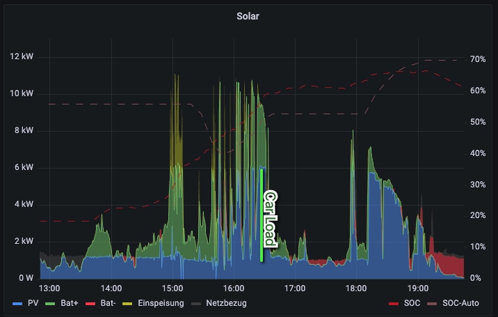

# Functionalities

## General
This adapter collects the data via the http API from your e-GoCharger over Wifi.

## Installation
You can just add a instance to ioBroker with the go-e Adapter

## Configuration of the Hardware
To enable the Adapter you must activate the http-interface via the app.
1. Connect the mobile device with the hotspot WIFI of the Hardware
1. Open the go-eCharger App
1. go to Cloud
1. Advanced Settings (erweiterte Einstellungen)
1. Activate HTTP Interface

## Configuration of the ioBroker Adapter
- Server or IP-Address
 Please enter here the Hostname or the IP-Adress to connect to the go-eCharger. By default the go-eCharger registers with the given hostname.

- Service Update intervall
Defines in wich intervall will the status requested from the adpater. Recommed 30 secs. Supplier recommed a minimum of 5 secs

-  Update Intervall for Updated
Defines how ofter should the adapter allow to reconfigure e.g. maxAmpere. To often configuration could destroy the Hardware and the car!

## Decission matrix: Use case to adapter function
If you dont know which function you should use in your script or environment, just use this table and examples:
| Available data | example | use function/attribute | use case description |
|:--|:--:|:--|:--|
| available amperes | 10A | ampere | you know how many consumtion in ampere is used by other devices in you environment and know that the adapter should only load with a specific amount of amperes |
| available watts | 11.000 W | max_watts | from your solar power you can see how many energy is received and want to use all the power to get your car loaded |
| delta available watts | +1.000 W / -1.000 W | adjustAmpLevelInWatts | you have a solar power installed and use some devices in parallel and you are gettings the rest of available power by your general electric meter |
| ioBroker implemented | Object-IDs | Settings | you have implemented your solar power, house Batter or houseConsumption in ioBroker. Connect the devices to this adapter and let the adapter do the job for you |

# Adapter functions

In this paragraph are listet additional functionalities which can be used for an easier implementation in ioBroker to use it with other devices.
- [access_state](#access-state)
- [allow_charging](#allow-chargeing)
- [ampere](#ampere)
- [amperePV](#amperePV)
- [energy](#energy)
  - [adjustAmpLevelInWatts](#-adjust-the-ampere-level-by-using-watts)
  - [max_watts](#-maximum-watts)
- [max_load](#-max-load)
- settings
  - ampere_level1
  - ampere_level2
  - ampere_level3
  - ampere_level4
  - ampere_level5
  - color
    - idle
    - chargeing
    - finish
  - led_save_energy
  - led_brightness
- [stop_state](#stop-state)
- [unlock_state](#unlock-state)
- [Foreign Objects](#foreign-objects)
- [LoadAtLeast6A](#load-at-least-6a)
- [phaseSwitchModeBuffer](#phaseSwitchModeBuffer)

## Access State

| go-e attribute | Type | Unit | Example Attritute position |
| -- | -- | -- | --:|
| [ast](https://github.com/goecharger/go-eCharger-API-v1/blob/master/go-eCharger%20API%20v1%20EN.md) | integer | mode | go-e.0.access_state |

Access control to select the method to grant access to he device.
0: open
1: RFID / App needed
2: electricity price / automatic

## Allow Chargeing
| go-e attribute | Type | Unit | Example Attritute position |
| -- | -- | -- | --:|
| [alw](https://github.com/goecharger/go-eCharger-API-v1/blob/master/go-eCharger%20API%20v1%20EN.md) | integer | mode | go-e.0.allow_charging |

allow_charging: PWM signal may be present
0: no
1: yes

## Ampere
| go-e attribute | Type | Unit | Example Attritute position |
| -- | -- | -- | --:|
| [amp](https://github.com/goecharger/go-eCharger-API-v1/blob/master/go-eCharger%20API%20v1%20EN.md) | integer | ampere | go-e.0.ampere |

This attribute selects the amount of ampere which can be used for loading.
Ampere value for the PWM signaling in whole ampere of 6-32A.

## AmperePV
| go-e attribute | Type | Unit | Example Attritute position |
| -- | -- | -- | --:|
| [amx](https://github.com/goecharger/go-eCharger-API-v1/blob/master/go-eCharger%20API%20v1%20EN.md) | integer | ampere | go-e.0.ampere |

This attribute is the same as Ampere but does not store the data permanent. After a restart this information is lost. Ampere is because of the EEPROM of the device only 100000 times writeable. If you use a Photovoltaic with go-e you should use this attribute insted of Ampere.

## Energy
Adjust all settings about the energy. This node is not writable, but it conatins sveral switches
### Maximum Watts

| go-e attribute | Type | Unit | Example Attritute position |
| -- | -- | -- | --:|
| - | integer | watts | go-e.0.energy.max_watts |

The hardware can adjust, how many ampere are allowed to be used during the load process. Any kind of Photo Voltaic or cunsumption messuring device speaking about Watts and mostly not amperes. To use the amoutn of watts and do the calulation with the connected phases or the connected adapter it has to recalculate to the amperes.

For this set the `go-e.0.energy.max_watts` (0 is you instance of the adapter) with the maximum allowed amount of watts.
The update process will be only send to the device every 30 secounds. This setting can be changed within the settings menu, but it is recommed to do it not more often. Some more information in the [official manual](https://github.com/goecharger/go-eCharger-API-v1/blob/master/go-eCharger%20API%20v1%20DE.md).

## Adjust the ampere level by using watts
| go-e attribute | Type | Unit | Example Attritute position |
| -- | -- | -- | --:|
| - | integer | watts | go-e.0.energy.adjustAmpLevelInWatts |
If your photo voltaic device are serving just the amout of watts which are currently to mush in your environment, this function can just the ampere level, by handover a number of watts.
e.g. If you want to give your car loader e.g. more 1000 watts more power just write into that value 1000. The same, if you want to reduce the amout by 1000 watts you have to write here -1000.

The endpoint in this adpter is `go-e.0.energy.adjustAmpLevelInWatts`. The update process will be only send to the device every 30 secounds. This setting can be changed within the settings menu, but it is recommed to do it not more often.

## Max Load
| go-e attribute | Type | Unit | Example Attritute position |
| -- | -- | -- | --:|
| [dwo](https://github.com/goecharger/go-eCharger-API-v1/blob/master/go-eCharger%20API%20v1%20EN.md) | integer | ampere | go-e.0.max_load |
Shutdown value in kWh if stp==2, for dws parameter

## Settings
This node groups several attributes for general settings.
The node itself is not writeable.

### Ampere Level 1-5
| go-e attribute | Type | Unit | Example Attritute position |
| -- | -- | -- | --:|
| [al1](https://github.com/goecharger/go-eCharger-API-v1/blob/master/go-eCharger%20API%20v1%20EN.md) | integer | ampere | go-e.0.settings.ampere_level1 |
| [al2](https://github.com/goecharger/go-eCharger-API-v1/blob/master/go-eCharger%20API%20v1%20EN.md) | integer | ampere | go-e.0.settings.ampere_level2 |
| [al3](https://github.com/goecharger/go-eCharger-API-v1/blob/master/go-eCharger%20API%20v1%20EN.md) | integer | ampere | go-e.0.settings.ampere_level3 |
| [al4](https://github.com/goecharger/go-eCharger-API-v1/blob/master/go-eCharger%20API%20v1%20EN.md) | integer | ampere | go-e.0.settings.ampere_level4 |
| [al5](https://github.com/goecharger/go-eCharger-API-v1/blob/master/go-eCharger%20API%20v1%20EN.md) | integer | ampere | go-e.0.settings.ampere_level5 |

Ampere Level 1 for push button on the device.
6-32: Ampere level activated
0: level deactivated (is skipped)
Ampere Level 2 for push button on the device.
Must be either 0 or >al1

## Stop State
| go-e attribute | Type | Unit | Example Attritute position |
| -- | -- | -- | --:|
| [stp](https://github.com/goecharger/go-eCharger-API-v1/blob/master/go-eCharger%20API%20v1%20EN.md) | integer | ampere | go-e.0.stop_state |

Automatic shutdown. Stops the loading Process automated after the giver amount of kWh.
0: deactivated
2: switch off after kWh

## Cable Unlock Mode (Unlock State)

Cable lock adjustment. This attribute defins when the cable locks and releases.
0: lock as long as the car is plugged in (default)
1: Automatically unlock after charging
2: Always leave the cable locked

## Foreign Objects
If you use from other vendors adapters adapters to read the current energy situation of consumtion or PV generating you can use these objects directly. For that you do not have to use own additional scripts.

We are using here the Adapter of Fronius. But it could be used any object you have.

### Available Solar Power
This attibute explains this adapter how much power it can use to load the car.

Example:
|go-e Adapter name | Foreign Adapter Attribute | Example Value | Settings onlyAck | Settings Negate? | Notes |
|:-- |:-- |:--:|:--:|:--:|:-- |
| solarPowerForeignObjectID | fronius.0.powerflow.P_Grid | -1000.0 | true | true | Fronius gives the values which is send to the grig negative. For that you have to put on the `Negative?` setting. Fronius is sending the values with `ack:true`, so enable the `Only ack?` setting. |
| houseConsumptionForeignObjectID | *empty* | - | - | - | Fronius does not provide a seperated PV_Production value. It is already covered in PV_GRID; see above |
| houseConsumptionForeignObjectID | fronius.0.powerflow.P_Akku | -1000.0 | true | true | If you want to prioritize the loading of the car before you want to load your home battery, you can add the akku load as well |
| bufferToSolar | *fixed value* | 100 | - | - | This is the buffer, to not consume energy from the grid, when the sun is leaving. It should cover the 60s refresh timeframe. |

It should result in automatism like this graph:

# Load At Least 6A
This option set the behavior of the adapter to continue loading the car with reduced speed, even if there is not enougth solar power available.

# phaseSwitchModeBuffer
Default: 500 W  
  
This is the buffer to the settings in phaseSwitchWatts. This buffer reduces the amount to change between 1phses and 3-phases loading operation. To disable set to 0.  
Default phaseSwitchWatts is 4200 (Watts).  

'''Example:'''
Setup: phaseSwitchWatts = 4200; phaseSwitchModeBuffer = 500;
| pGrid [Watt] | current Mode | required mode | explain |
|:--|:--:|:--:|:--|
| 7000 | 3-phases | 3-phases | usual operation |
| 4000 | 3-phases | 3-phases | ready to switch to 1-phase, but buffer not reached |
| 4699 | 3-phases | 1-phase | switch reached |
| 2000 | 1-phase | 1-phase | usual operation |
| 4201 | 1-phase | 1-phase | ready to switch, but buffer not reached |
| 4701 | 1 phase | 3-phases | switch level reached |